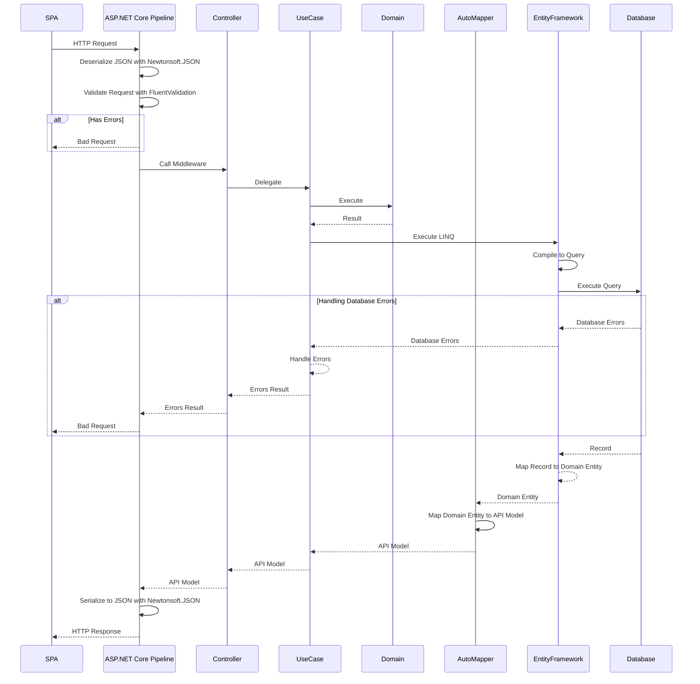

# Architecture

本システムのアーキテクチャを以下に示す。

## システムアーキテクチャ

バックエンドとして ASP.NET Core による RESTful な Web API 構成、フロントエンドとして Nuxt.js による SPA 構成とする。

## バックエンドのレイヤー構成

責務ごとにレイヤー分割を行う設計とし、各レイヤーの責務を以下に示す。

### プレゼンテーション層

1. Controller
   API として公開するアクションを REST の原則にならい、リソース志向で定義する。アクションは可読性の為に Controller クラスを partial として定義し、アクションごとに別ファイルとして定義する。
   また、処理は基本的にアプリケーション層の UseCase クラスへ委譲する。そのため、DbContext クラスを含むドメイン層のサービスを、Controller クラスへ DI することは原則禁止である。
   入力値の検証は Contoroller クラスではなく、FluentValidation で検証クラスとして実装し、ASP.NET Core Pipeline のモデルバインディング時に行う。ただし、データベースへの登録や更新を行うまでは整合性を担保できない、一意性約違反などについてはアプリケーション層の UseCase クラスで例外を補足し、その結果をもとに Controller クラスで処理を行う。

2. Profile
   ドメイン層のモデルからプレゼンテーション層のモデルへのマッピングは AutoMapper を利用する。マッピングの定義はプレゼンテーション層で AutoMapper の Profile クラスとして実装する。

3. Validation
   入力値の検証は FluentValidation で検証クラスとして実装する。システムで共通的に利用する可能性のある検証ロジックについては、Specification パターンとして機能を独立させ、各検証ロジックから呼び出す。

### アプリケーション層

1. UseCase
   ドメインロジックを操作しアプリケーションロジックを確立する。メソッドは可読性の為に UseCase クラスを partial として定義し、メソッドごとに別ファイルとして定義する。
   また、アプリケーション層の UseCase クラスへプレゼンテーション層のサービスを DI することは原則禁止である。アプリケーション層からプレゼンテーション層のサービス、HTTP サービスへのアクセスを迫られた場合は、根本的に設計が誤っている可能性がある。それでもプレゼンテーション層のサービス、HTTP サービスへアクセスする必要がある場合には、インフラストラクチャ層のサービスと同様に抽象化し、依存性を逆転させて DI させること。

### ドメイン層

1. Domain
   システムの中核となるドメインロジックを定義する。原則として他のサービスへは依存しない。ただし、データ層へのアクセスについては、EntityFrameworkCore を利用し、エンティティの定義や物理データベースへのマッピングをドメイン層で定義している。リポジトリパターンについてはコストに見合うリターンが見合わないため実装しない。

2. async/await
   ドメイン層のプロジェクトは将来的に新たなプレゼンテーション層で利用される可能性がある。ASP.NET Core では SynchronizationContext が存在しないため、await 時のコンテキスト制御は必要ないが、コンテキスト制御が必要な他プラットフォームで利用される可能性を考慮し、ドメイン層では必ず ConfigureAwait でコンテキストの制御を明示すること。(ConfigureAwait を明示しないと [CA2007](https://docs.microsoft.com/ja-jp/visualstudio/code-quality/ca2007?view=vs-2019) の警告が検知される。)

### インフラストラクチャ層

1. Infrastructure
   メールや API など外部サービスの実装を定義する。
   原則として他レイヤーには抽象化されたサービスとして DI されるように実装を隠蔽する。

### 処理シーケンス

各レイヤー間の処理シーケンスの概要を以下に示す。

## プロジェクト構成

プロジェクトは以下の 4 種類に大別する。

+ Applications プロジェクト
  エントリポイントを持つメインプログラムのプロジェクトとして作成し、レイヤーの責務としてプレゼンテーション層、アプリケーション層を担う。
+ Domains プロジェクト
  ドメインロジックを持つプロジェクトとして作成し、レイヤーの責務としてドメイン層を担う。必要に応じ、機能によってプロジェクトを細分化する。
+ Extensions プロジェクト
  アプリケーションロジックやドメインロジックを含まない、拡張機能のプロジェクトとして作成する。Extensions プロジェクトとして作成するかどうかの基準は、名前空間等を変更することで他プロジェクトへ転用できる (システム固有のロジックを含まない) ことである。
+ Infrastructures プロジェクト
  外部サービスの実装を持つプロジェクトとして作成し、レイヤーの責務としてインフラストラクチャ層を担う。
