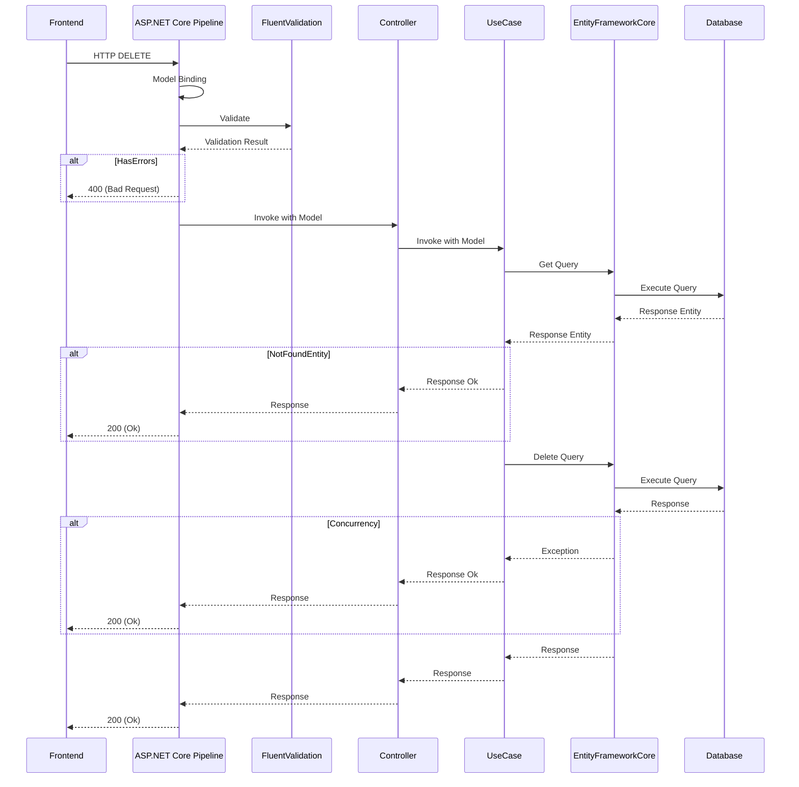

# DELETE API の実装

リソースを削除する DELETE API の実装方法を説明します。

## 処理フロー

DELETE API における基本的な処理フローを以下に示します。

## DELETE アクション

データの削除処理は基本的に DELETE アクションとして実装します。
アクションのレスポンスはデータの削除に成功した場合は 200 (Ok) 、検証エラーの場合は 400 (Bad Request) の２ケースになります。
