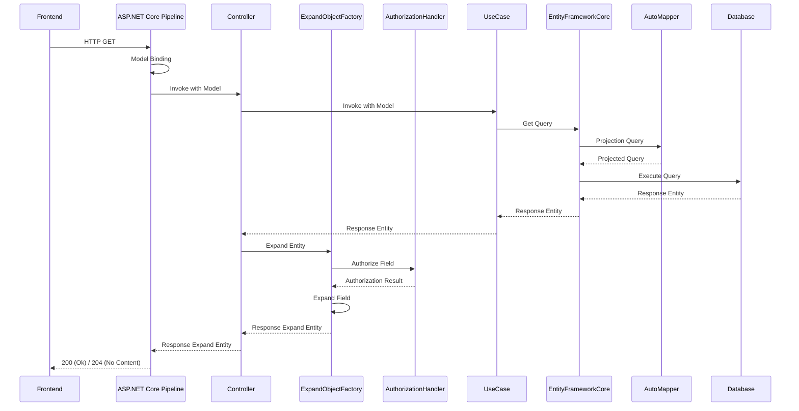

# GET API の実装

リソースを取得する GET API の実装方法を説明します。

## 処理フロー

GET API における基本的な処理フローを以下に示します。



## GET アクション

データの取得処理は基本的に GET アクションとして実装します。
また、原則として HTTP レスポンスステータスとしてエラーを返してはいけません。
アクションのレスポンスはデータが存在する場合は 200 (OK)、データが存在しない場合は 204 (No Contet) の２ケースになります。

## データの抽出

取得するデータの抽出条件は、フロントエンドからクエリストリングを経由して指定されたものをもとに、動的にクエリを構築します。
例えば、以下のような `UserEntity` のリソースを公開する API の抽出処理を実装してみましょう。

```cs {.line-numbers}
namespace RootNamespace.Domains.Entities
{
    public class UserEntity
    {
        public int Id { get; set; }
        public string Name { get; set; }
        public string FirstName { get; set; }
        public string LastName { get; set; }
    }
}
```

まずは、検索条件として公開する `SearchConditions` クラスを作成します。
`{Resource}SearchConditions` という形でリソース名の単数形と `SearchConditions` というサフィックスを繋げて命名し `Models` 名前空間に定義します。
`SeachConditions` クラスには検索条件として公開するプロパティを `SearchConditions<T>` 型で定義します。
`SearchConditions<T>` 型で定義することで多くの比較演算子、論理演算子による複雑な条件を自動でサポートします。
`SearchConditions<T>` クラスのジェネリックパラメーターはリソースのプロパティと同じ型を指定します。
例えば、`UserEntity` クラスの `Id` プロパティは `int` 型なため、`UserSearchConditions` クラスの `Id` プロパティは `SearchConditions<int>` 型となります。
ただし、リソースのプロパティが `Nullable<T>` 型の場合でも `Searchonditions<T>` クラスの型はプリミティブ型を指定してください。
つまり、`int? NullableValue { get; set; }` のようなリソースのプロパティの検索条件は `Searchonditions<int?>` 型ではなく `Searchonditions<int>` となります。

```cs {.line-numbers}
namespace RootNamespace.Applications.WebHost.Features.Users.Models
{
    public partial class UserSearchConditions
    {
        public SearchConditions<int> Id { get; set; }
        public SearchConditions<string> Name { get; set; }
        public SearchConditions<string> FirstName { get; set; }
        public SearchConditions<string> LastName { get; set; }
    }
}
```

`SearchConditions` クラスを定義したら、`SeachConditions` オブジェクトを使ってクエリを構築する `SearchSpecification` クラスを定義します。
`{Resource}SearchSpecification` という形でリソース名の単数形と `SearchSpecification` というサフィックスを繋げて命名し `Specifications` 名前空間に定義します。
`SearchSpecification` クラスは `RootNamespace.Extensions.AspNetCore.Mvc.ApplicationModels` 名前空間の `SearchSpecification<T>` クラスを継承して実装します。
`SearchSpecification<T>` クラスのジェネリックパラメーターにはリソースの型を指定します。
そして、コンストラクターで先ほど作成した `SearchConditions` オブジェクトを受け取り、クエリの構築を行います。
`SearchConditions` クラスのプロパティの型が `Searchonditions<T>` 型の場合には基本的に `TryAdd` メソッドを呼び出すだけでクエリの構築が行われます。

```cs {.line-numbers}
namespace RootNamespace.Applications.WebHost.Features.Users.Specifications
{
    public partial class UserSearchSpecification : SearchSpecification<UserEntity>
    {
        public UserSearchSpecification(UserSearchConditions conditions)
        {
            TryAdd(conditions.Id);
            TryAdd(conditions.Name);
            TryAdd(conditions.FirstName);
            TryAdd(conditions.LastName);
        }
    }
}
```

作成した `SearchConditions` クラスと、`SeachSpecification` クラスをもとにコントローラーアクションを実装します。

```cs {.line-numbers}
namespace RootNamespace.Applications.WebHost.Features.Users.Controllers
{
    public partial class UsersController
    {
        private readonly UserUseCase UserUseCase;
        private readonly IExpandoObjectFactory ExpandoObjectFactory;
        public UsersController(UserUseCase useCase, IExpandoObjectFactory expandoObjectFactory)
        {
            UserUseCase = useCase;
            ExpandoObjectFactory = expandoObjectFactory;
        }
        [HttpGet]
        [ProducesResponseType(StatusCodes.Status200OK, Type = typeof(IEnumerable<UserEntity>))]
        public virtual async Task<object> Get(UserSearchConditions conditions, ISortingQuery sorting, IPagingQuery paging, IFieldQuery field, CancellationToken cancellationToken)
        {
            /* クエリストリングで指定された条件をもとにクエリを構築します。 */
            var specification = new UserSearchSpecification(conditions);

            /* UseCase に処理を移譲しデータの抽出結果を受け取ります。 */
            var results = await UserUseCase.GetAsync(specification, sorting, paging, field, cancellationToken);

            /* 指定されたフィールド名をもとに ExpandObject に展開し返却します。 */
            var fieldNames = field.GetValidFieldNames<UserEntity>().ToArray();
            var models = new List<object>();
            foreach (var result in results)
            {
                var model = await ExpandoObjectFactory.CreateAsync(
                    typeof(UserEntity),
                    result,
                    fieldNames,
                    Operations.Read,
                    includeUnauthorizedProperty: true,
                    includeNullObject: true);
                models.Add(model);
            }
            return models;
        }
    }
}
```

### ISortingQuery

`ISortingQuery` オブジェクトをアクションパラメーターとして指定することでデータの並び替えをフロントエンドから指定できるようになります。
詳細はフロントエンドの章で説明します。

### IPagingQuery

`IPagingQuery` オブジェクトをアクションパラメーターとして指定することでデータのページングをフロントエンドから指定できるようになります。
詳細はフロントエンドの章で説明します。

### IFieldQuery

`IFieldQuery` オブジェクトをアクションパラメーターとして指定することでデータの取得するフィールドをフロントエンドから指定できるようになります。
詳細はフロントエンドの章で説明します。

### UseCase

データの抽出処理は `UseCase` のベースクラスで実装されているため、すべてのユースケースで実行することができます。
`UseCase` のベースクラスは `RootNamespace.Applications.WebHost.Core.UseCases` 名前空間で定義されており、`EntityFrameworkCore` と `AutoMapper` の `Projection` 機能で動的にクエリの構築を行っています。

### ナビゲーションプロパティの抽出

`EntityFrameworkCore` で定義されているナビゲーションプロパティに関しては処理の拡張を行わずにデータの抽出が可能です。
しかし、外部キーを定義できないナビゲーションのデータを抽出するには `UseCase` の処理を拡張する必要があります。
例えば以下のようなエンティティを例に考えてみます。注文データを表す `Order` エンティティがあり、注文担当者の担当者コード (`EmployeeId`)、注文先の得意先コード (`CustomerId`) が定義されています。社員マスターは社員コードが主キーであり、注文データの社員コードは外部キーとなります。しかし、得意先マスターは適用日ごとに世代管理を行っており、得意先コードは外部キーとなりえず、得意先コードと注文日 (`OrderDate`) を基準に得意先の世代が定まるとします。

```cs {.line-numbers}
namespace RootNamespace.Domains.Entities
{
    public class OrderEntity
    {
        public int OrderId { get; set; } /* primary key */
        public string OrderName { get; set; }
        public DateTime OrderDate { get; set; }
        public int EmployeeId { get; set; } /* foreign key */
        public int CustomerId { get; set; }
    }
    public class CustomerEntity
    {
        public int CustomerId { get; set; } /* primary key */
        public string CustomerName { get; set; }
        public DateTime BeginDate { get; set; } /* primary key */
        public DateTime EndDate { get; set; }
    }
    public class EmployeeEntity
    {
        public int EmployeeId { get; set; } /* primary key */
        public string EmployeeName { get; set; }
    }
}
```

社員マスターについては注文データから外部キーを定義できるため、以下のようにナビゲーションプロパティを定義することで、`UseCase` クラスの処理の拡張なしにフロントエンドから `$fields=Employee.EmployeeName` と指定しデータを抽出することができます。

```cs {.line-numbers highlight=9}
namespace RootNamespace.Domains.Entities
{
    public class OrderEntity
    {
        public int OrderId { get; set; } /* primary key */
        public string OrderName { get; set; }
        public DateTime OrderDate { get; set; }
        public int EmployeeId { get; set; } /* foreign key */
        public EmployeeEntity Employee { get; set; }
        public int CustomerId { get; set; }
    }
}
```

しかし、得意先マスターへは外部キーを定義できないため、`UseCase` クラスの処理の拡張が必要となります。
まずは、社員マスターと同様にナビゲーションプロパティを定義します。
注文データの注文日と得意先マスターの適用日で得意先データは１：１の関係になりえますが、ナビゲーションプロパティは必ずコレクションで定義してください。これは外部キーを定義できないナビゲーションプロパティにおける制約となります。

```cs {.line-numbers highlight=11}
namespace RootNamespace.Domains.Entities
{
    public class OrderEntity
    {
        public int OrderId { get; set; } /* primary key */
        public string OrderName { get; set; }
        public DateTime OrderDate { get; set; }
        public int EmployeeId { get; set; } /* foreign key */
        public EmployeeEntity Employee { get; set; }
        public int CustomerId { get; set; }
        public IEnumerable<CustomerEntity> Customers { get; set; }
    }
}
```

また、`EntityFrameworkCore` のエンティティの定義では上記で定義したナビゲーションプロパティを `Ignore` メソッドで除外をしてください。
除外しない場合は `CustomerId` などのプロパティ名から `EntityFrameworkCore` によって自動で関連付けが行われ、登録処理などで想定外の主キー違反の例外を補足することになります。

```cs {.line-numbers highlight=7}
namespace RootNamespace.Domains.EntityTypeConfigurations
{
    public class OrderEntityTypeConfiguration : IEntityTypeConfiguration<OrderEntity>
    {
        public void Configure(EntityTypeBuilder<OrderEntity> builder)
        {
            builder.Ignore(x => x.Customers);
        }
    }
}
```

ナビゲーションプロパティを定義したら `UseCase` クラスのメソッドをオーバーライドしテーブルの結合処理を追加します。
必要に応じ `Task<T> GetByPrimaryKeyAsync(object[] keyValues, IFieldQuery field, CancellationToken cancellationToken = default)` メソッドもオーバーライドし同様にテーブルの結合処理を追加します。
以下の処理を実装することで フロントエンドから `$fields=Customers.CustomerName` と指定しデータを抽出することができます。

```cs {.line-numbers highlight=7-16}
namespace RootNamespace.Applications.WebHost.Features.Orders.UseCases
{
    public partial class UserUseCaseBase : UseCaseBase<OrderEntity>, IDependencyInjectionService
    {
        public override Task<OrderEntity[]> GetAsync(SearchSpecification<OrderEntity> specification, ISortingQuery sorting, IPagingQuery paging, IFieldQuery field, CancellationToken cancellationToken = default)
        {
            var source = Context
                .Set<OrderEntity>()
                .SelectWith(x => new()
                {
                    Customers = Context.Set<CustomerEntity>()
                        .Where(customer => customer.CustomerId == x.CustomerId)
                        .Where(customer => customer.BeginDate <= x.OrderDate)
                        .Where(customer => customer.EndDate >= x.OrderDate)
                        .AsEnumerable(),
                });
            return GetCoreAsync(source, specification, sorting, paging, field, cancellationToken);
        }
    }
}
```

テーブルの結合処理は他処理でも使用することが想定されるため、基本的には以下のように拡張メソッドとして定義します。

```cs {.line-numbers}
namespace RootNamespace.Domains.Data.QueryableExtensions
{
    public static class OrderEntityQueryableExtensions
    {
        public static IQueryable<OrderEntity> LeftJoin(this IQueryable<OrderEntity> source, DbSet<CustomerEntity> customers)
        {
            return source.SelectWith(x => new()
            {
                Customers = customers
                    .Where(customer => customer.CustomerId == x.CustomerId)
                    .Where(customer => customer.BeginDate <= x.OrderDate)
                    .Where(customer => customer.EndDate >= x.OrderDate)
                    .AsEnumerable(),
            });
        }
    }
}
```

```cs {.line-numbers highlight=9}
namespace RootNamespace.Applications.WebHost.Features.Orders.UseCases
{
    public partial class UserUseCaseBase : UseCaseBase<OrderEntity>, IDependencyInjectionService
    {
        public override Task<OrderEntity[]> GetAsync(SearchSpecification<OrderEntity> specification, ISortingQuery sorting, IPagingQuery paging, IFieldQuery field, CancellationToken cancellationToken = default)
        {
            var source = Context
                .Set<OrderEntity>()
                .LeftJoin(Context.Set<CustomerEntity>());
            return GetCoreAsync(source, specification, sorting, paging, field, cancellationToken);
        }
    }
}
```

## 承認要件

`ExpandObjectFactory` による `ExpandObject` へのリソースの展開時に、承認要件をもとに返却するフィールドをフィルターすることができます。
例えば、`UserEntity` の `Password` フィールドのようにセキュリティ的に返却するべきでない値や、認証されているユーザーによって閲覧できる情報の範囲が異なる場合に本機能を利用します。

承認要件は `RootNamespace.Extensions.AspNetCore.Authorization` 名前空間の `ExpandObjectAuthorizationHandler<TRequirement, TRootResource, TResource>` クラスを継承することで実装します。
１ファイルに多くのコードを実装すると可読性が落ちるため、原則としてオペレーションごとに承認ハンドラーを実装します。
`{Resource}{Operation}AuthorizationHandler` という形でリソース名の単数形とオペレーション名、`AuthorizationHandler` というサフィックスを繋げて命名し `Authorizations` 名前空間に定義します。
例えば、`UserEntity` のリソースを取得するオペレーションに対する `AuthorizationHandler` の場合は `UserReadAuthorizationHandler` という命名になります。
`UserEntity` の `Password` フィールドを、リソースを取得するオペレーションで禁止する場合は以下のようになります。

```cs {.line-numbers}
using RootNamespace.Applications.WebHost.Core.Authorizations;
namespace RootNamespace.Applications.WebHost.Features.Users.Authorizations
{
    public partial class UserReadAuthorizationHandler : ExpandObjectAuthorizationHandler<OperationAuthorizationRequirement, UserEntity>, IDependencyInjectionService<IAuthorizationHandler>
    {
        protected override Task HandleRequirementAsync(AuthorizationHandlerContext context, OperationAuthorizationRequirement requirement, ExpandObjectAuthorizationResource<UserEntity> resource)
        {
            /* requirement.Name にはオペレーション名が渡されます。 */
            if (requirement.Name == Operations.Read.Name)
            {
                /* resource.PropertyName には承認要件を検証するプロパティ名が渡されます。 */
                if (resource.PropertyName == nameof(UserEntity.Password))
                {
                    context.Fail();
                    return Task.CompletedTask;
                }
            }

            if (!context.HasFailed && !context.HasSucceeded)
            {
                context.Succeed(requirement);
            }
            return Task.CompletedTask;
        }
    }
}
```

`AuthorizationHandlerContext` オブジェクトからはユーザー情報である `ClaimsPrincipal` オブジェクトにアクセスすることができるため、認証されているユーザーによってフィルターを行うことができます。`ExpandObjectAuthorizationResource<TRootResource, TResource>` オブジェクトではリソースオブジェクト自体にアクセスすることができるため、ログインユーザーが作成したリソースのみ読み取り可能という判断も行うことができます。
また、承認要件で `Fail()` としたプロパティは `ExpandoObjectFactory.CreateAsync` メソッドのパラメーターの `includeUnauthorizedProperty` を `true` としているため、プロパティ自体が返却項目に含まれなくなる訳ではなく、返却される値が `null` に設定されます。
これはフロントエンドの実装に Vue.js を利用するため、データ構築時にオブジェクトのメンバーを確定しておかないとリアクティブにならないためです。
