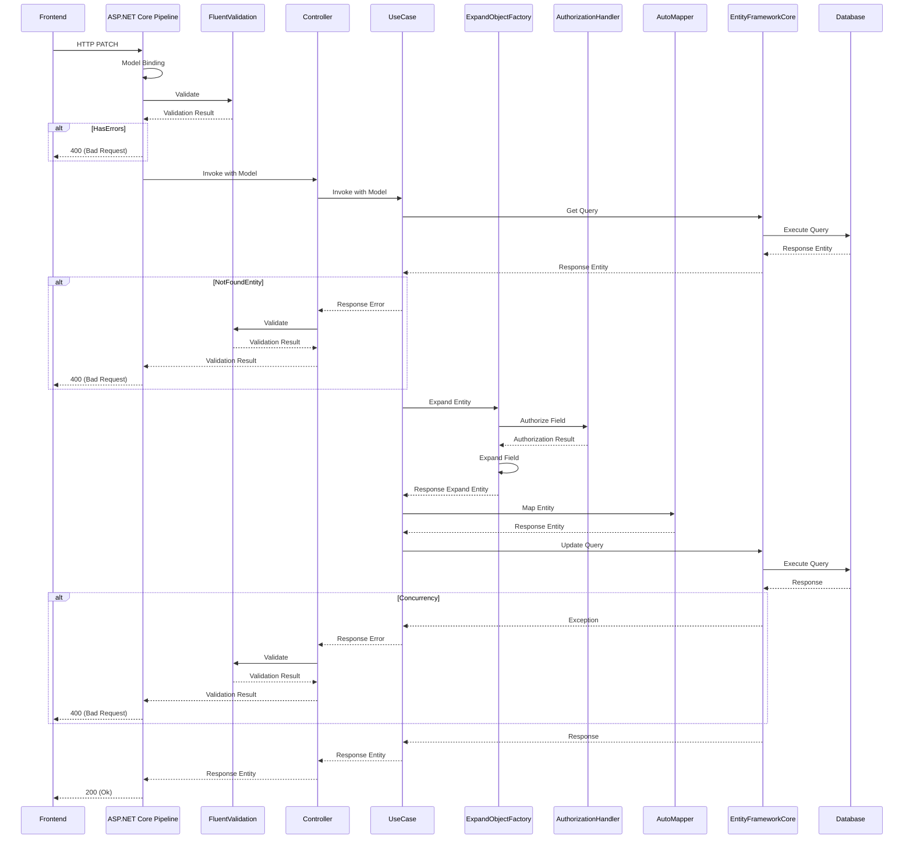

# PATCH API の実装

リソースを更新する PATCH API の実装方法を説明します。

## 処理フロー

PATCH API における基本的な処理フローを以下に示します。

## PATCH アクション

データの更新処理は基本的に PATCH アクションとして実装します。
アクションのレスポンスはデータの更新に成功した場合は 200 (Ok)、検証エラーの場合は 400 (Bad Request) の２ケースになります。
