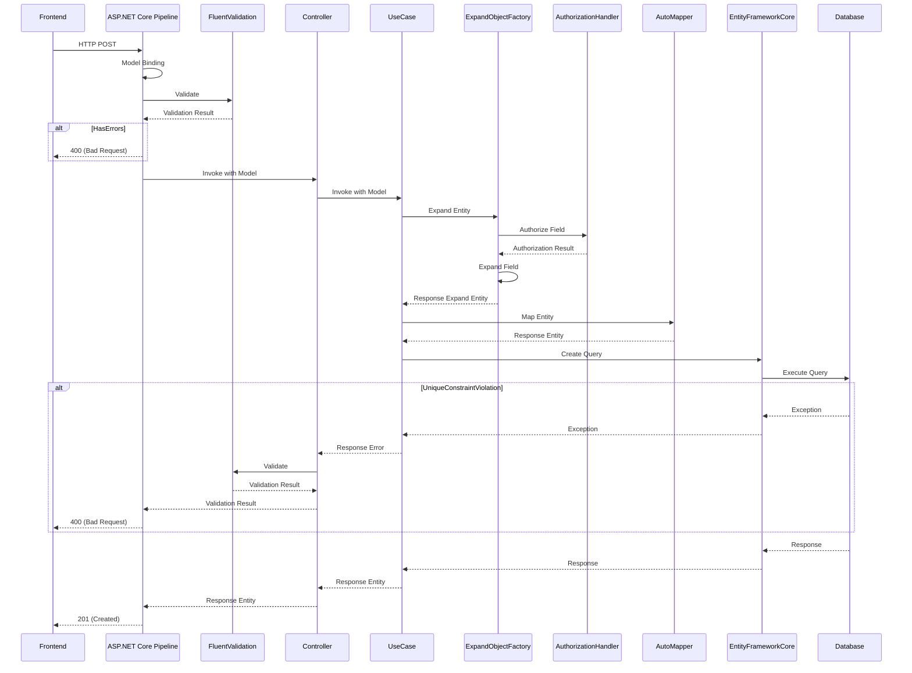

# POST API の実装

リソースを登録する POST API の実装方法を説明します。

## 処理フロー

POST API における基本的な処理フローを以下に示します。

## POST アクション

データの登録処理は基本的に POST アクションとして実装します。
アクションのレスポンスはデータの登録に成功した場合は 201 (Created)、検証エラーの場合は 400 (Bad Request) の２ケースになります。
